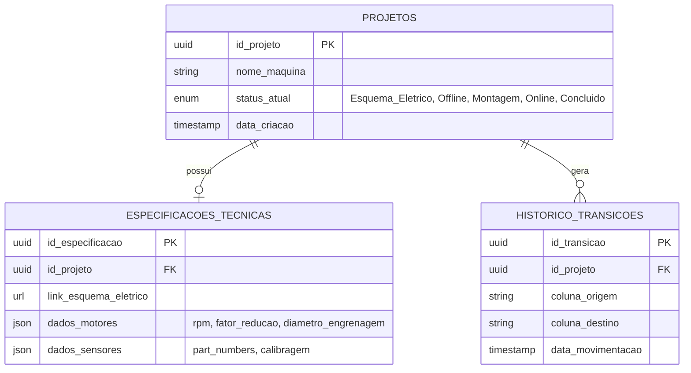

# Modelo de Dados — Diagrama Entidade-Relacionamento
Complementa a descrição textual em `Arquitetura.md`, seção 2.

## Diagrama

## Cardinalidades
* **Projetos → Especificacoes_Tecnicas**: 1:0..1 — um projeto tem no máximo um registro de especificações técnicas (criado/atualizado via `PUT`, ver `Especificacao-API.md`).
* **Projetos → Historico_Transicoes**: 1:N — um projeto acumula um registro de histórico a cada movimentação de coluna.

## Regras de integridade derivadas do PRD/Arquitetura
* `status_atual` só pode assumir um dos 5 valores do enum, na ordem sequencial definida no fluxo de estados (`PRD.md`, seção 3).
* Um novo `Historico_Transicoes` é criado em toda mudança de `status_atual` — nunca há mudança de status sem registro de histórico correspondente (RF02).
* A transição de `status_atual` para `Concluido` exige que `Especificacoes_Tecnicas.dados_motores` e `dados_sensores` estejam preenchidos (regra aplicada por `ValidacaoParametrosFisicos`, não uma constraint de banco).
