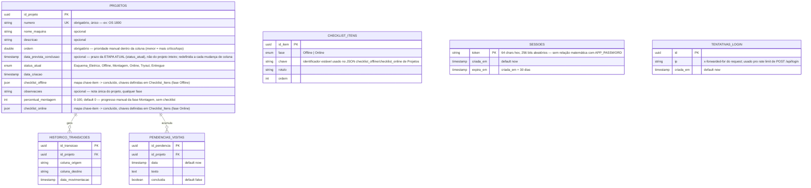

# Modelo de Dados — Diagrama Entidade-Relacionamento
Complementa a descrição textual em `Arquitetura.md`, seção 2.

## Diagrama

## Cardinalidades
* **Projetos → Historico_Transicoes**: 1:N — um projeto acumula um registro de histórico a cada movimentação de coluna.
* **Projetos → Pendencias_Visitas**: 1:N — log de pendências anotadas em visitas técnicas (fases Tryout/Entregue), cada visita vira uma entrada nova (nunca sobrescrita). Ver HU-19.
* **Checklist_Itens** não tem FK pra `Projetos` — é configuração global compartilhada por todos os projetos (a tela de Configurações edita essa tabela; o JSON `checklist_offline`/`checklist_online` de cada projeto guarda só os valores booleanos, referenciando os itens pela `chave`). Ver HU-20.
* **Sessoes** e **Tentativas_Login** não têm FK pra nenhuma outra tabela — suportam a autenticação de senha única (HU-21/HU-23) e não têm relação com projetos. Ver seção "Autenticação" em `Especificacao-API.md`.

> **Nota histórica:** a entidade `Especificacoes_Tecnicas` (dados de motores/sensores/esquema elétrico) e a regra `ValidacaoParametrosFisicos` existiram até esta sessão e foram **removidas por completo** a pedido do usuário (não fazem mais parte do produto) — ver HU-06/HU-07/HU-08 em `Backlog-Historias-Usuario.md`, marcadas como removidas.

## Regras de integridade derivadas do PRD/Arquitetura
* `status_atual` só pode assumir um dos 6 valores do enum, na ordem sequencial definida no fluxo de estados (`PRD.md`, seção 3) — **atenção:** o fluxo original tinha 5 colunas terminando em "Concluido"; nesta sessão a coluna final foi substituída por duas ("Tryout" → "Entregue"), a pedido do usuário. Ver HU-19.
* Um novo `Historico_Transicoes` é criado em toda mudança de `status_atual` — nunca há mudança de status sem registro de histórico correspondente (RF02).
* `Projetos.numero` é obrigatório e único (constraint de banco) — é o identificador primário usado na prática para localizar um projeto (ex: "OS 1800"). `nome_maquina` é opcional, informação secundária sobre a máquina física.
* `Projetos.ordem` usa fractional indexing (número de ponto flutuante, não um índice inteiro sequencial) — inserir um card entre dois outros é a média dos dois vizinhos, sem precisar reescrever a coluna inteira a cada reordenação manual de prioridade. Limitação aceita: reordenações repetidas exatamente no mesmo ponto podem, em teoria, fazer os valores convergirem ao longo de muito tempo de uso — não implementado nenhum rebalanceamento automático, considerado risco desprezível para o volume de uso esperado.
* `Projetos.data_prevista_conclusao` é opcional e está atrelada à etapa atual (`status_atual`), não ao projeto como um todo — o objetivo é permitir cobrar/verificar se a etapa corrente está pronta na data esperada antes de avançar. Ao mover o card para uma nova coluna, o valor anterior não é preservado no histórico: a UI abre um diálogo pedindo a nova data da etapa recém-iniciada (pode ser deixado em branco). Um card com essa data no passado é destacado visualmente (vermelho) no board.
* `Checklist_Itens` define dinamicamente os itens de cada checklist (Offline/Online), editáveis via tela de Configurações (add/renomear/excluir) — **não é mais um shape fixo de 4 campos**. Cada item vale sempre `100/N%` (N = quantidade de itens da fase no momento, recalculado a cada leitura, nunca armazenado). A transição de `status_atual` de `Offline` para `Montagem` (ou `Online` para `Tryout`) exige que todos os itens configurados da fase correspondente estejam `true` no JSON `checklist_offline`/`checklist_online` do projeto (regra aplicada por `validarChecklist`, não uma constraint de banco). Excluir um item não limpa a chave já salva nos projetos (fica órfã, ignorada no cálculo) — sem migração retroativa. Seed inicial (migração desta sessão) usa as mesmas 4+4 chaves que já existiam como campos fixos (`hardware`, `logicaFcFb`, `ihm`, `seguranca`, `testesIO`, `ajusteParametros`, `testesFuncionais`, `liberacao`), preservando o histórico real sem transformação de dado. Ver HU-20.
* `Projetos.observacoes` é uma nota única de texto livre, não um log — sobrescrita a cada edição, visível/editável independente da fase atual.
* `Projetos.percentual_montagem` é ajustado manualmente pelo usuário (slider de 5 em 5%), sem checklist de sub-etapas e **sem** exigência de 100% para avançar de `Montagem` para `Online` — ao contrário de `checklist_offline`, não há nenhuma regra de bloqueio associada a este campo.
* `Pendencias_Visitas` é um log de texto livre (nunca sobrescrito, ao contrário de `observacoes`) — cada visita técnica nas fases `Tryout`/`Entregue` vira uma nova linha com `data` automática. Sem regra de bloqueio associada. `concluida` (default `false`) marca se aquela pendência específica já foi resolvida — é só um check de acompanhamento, não afeta avanço de fase nem é obrigatório pra mover o card.
