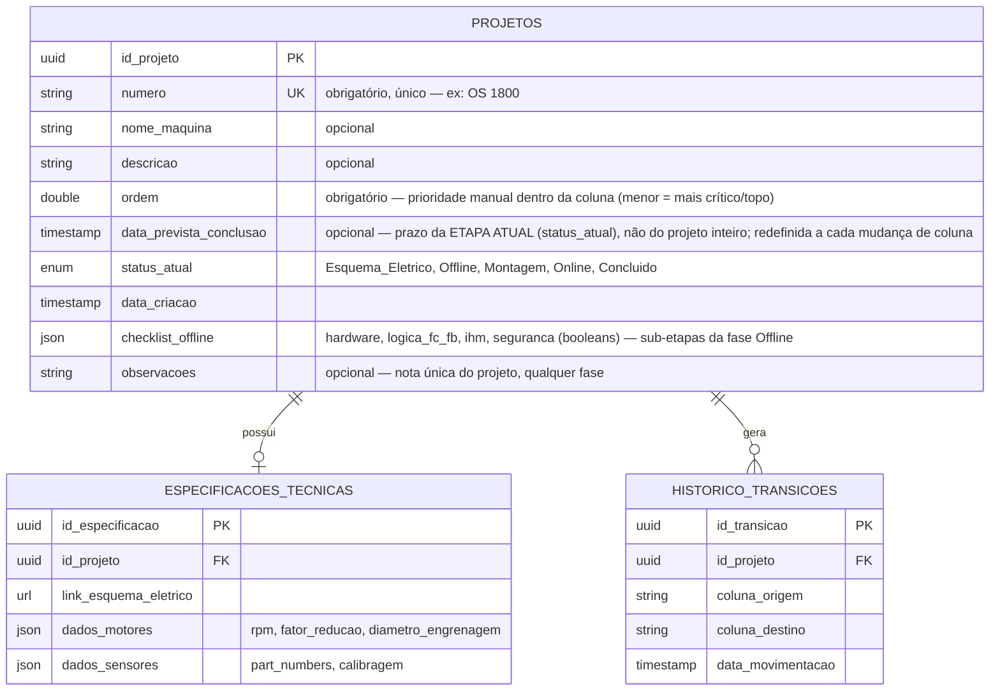

# Modelo de Dados — Diagrama Entidade-Relacionamento
Complementa a descrição textual em `Arquitetura.md`, seção 2.

## Diagrama

## Cardinalidades
* **Projetos → Especificacoes_Tecnicas**: 1:0..1 — um projeto tem no máximo um registro de especificações técnicas (criado/atualizado via `PUT`, ver `Especificacao-API.md`).
* **Projetos → Historico_Transicoes**: 1:N — um projeto acumula um registro de histórico a cada movimentação de coluna.

## Regras de integridade derivadas do PRD/Arquitetura
* `status_atual` só pode assumir um dos 5 valores do enum, na ordem sequencial definida no fluxo de estados (`PRD.md`, seção 3).
* Um novo `Historico_Transicoes` é criado em toda mudança de `status_atual` — nunca há mudança de status sem registro de histórico correspondente (RF02).
* A transição de `status_atual` para `Concluido` exige que `Especificacoes_Tecnicas.dados_motores` e `dados_sensores` estejam preenchidos (regra aplicada por `ValidacaoParametrosFisicos`, não uma constraint de banco).
* `Projetos.numero` é obrigatório e único (constraint de banco) — é o identificador primário usado na prática para localizar um projeto (ex: "OS 1800"). `nome_maquina` é opcional, informação secundária sobre a máquina física.
* `Projetos.ordem` usa fractional indexing (número de ponto flutuante, não um índice inteiro sequencial) — inserir um card entre dois outros é a média dos dois vizinhos, sem precisar reescrever a coluna inteira a cada reordenação manual de prioridade. Limitação aceita: reordenações repetidas exatamente no mesmo ponto podem, em teoria, fazer os valores convergirem ao longo de muito tempo de uso — não implementado nenhum rebalanceamento automático, considerado risco desprezível para o volume de uso esperado.
* `Projetos.data_prevista_conclusao` é opcional e está atrelada à etapa atual (`status_atual`), não ao projeto como um todo — o objetivo é permitir cobrar/verificar se a etapa corrente está pronta na data esperada antes de avançar. Ao mover o card para uma nova coluna, o valor anterior não é preservado no histórico: a UI abre um diálogo pedindo a nova data da etapa recém-iniciada (pode ser deixado em branco). Um card com essa data no passado é destacado visualmente (vermelho) no board.
* `Projetos.checklist_offline` tem 4 sub-etapas fixas, sempre nessa ordem: Hardware → Lógica (FC's e FB's) → IHM → Segurança. Cada uma vale 25% (checkbox binário, sem progresso parcial por item). A transição de `status_atual` de `Offline` para `Montagem` exige que as 4 estejam `true` (regra aplicada por `validarChecklistOffline`, não uma constraint de banco), igual em espírito à regra de `ValidacaoParametrosFisicos` para `Concluido`.
* `Projetos.observacoes` é uma nota única de texto livre, não um log — sobrescrita a cada edição, visível/editável independente da fase atual.
